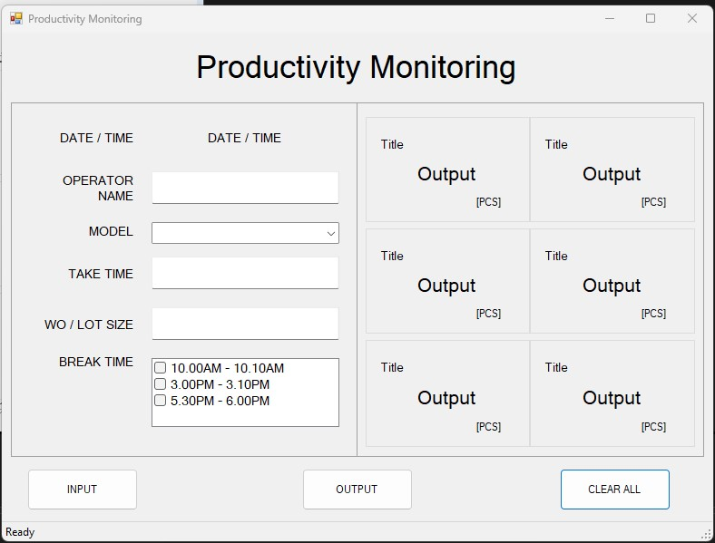

# Kanban-Productivity-Monitoring

This is a simple Kanban board that can be used to monitor productivity. It is based on the [Kanban board]

## How to use
1. Database: SQLite
2. IDE: Visual Studio 2022
3. Framework: .NET 4.8
4. Language: C#

## How to run
1. Open the solution in Visual Studio
2. Build the solution
3. Run the solution

<!-- Photo -->
## Image

